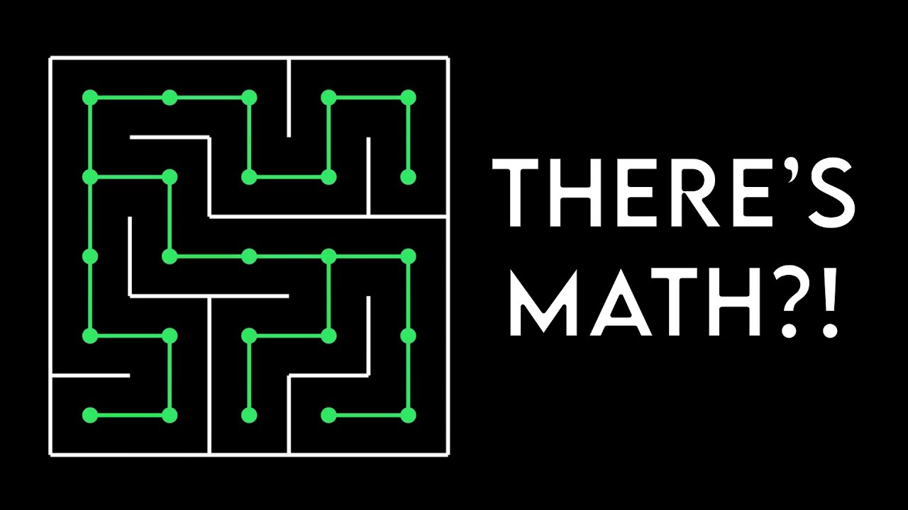
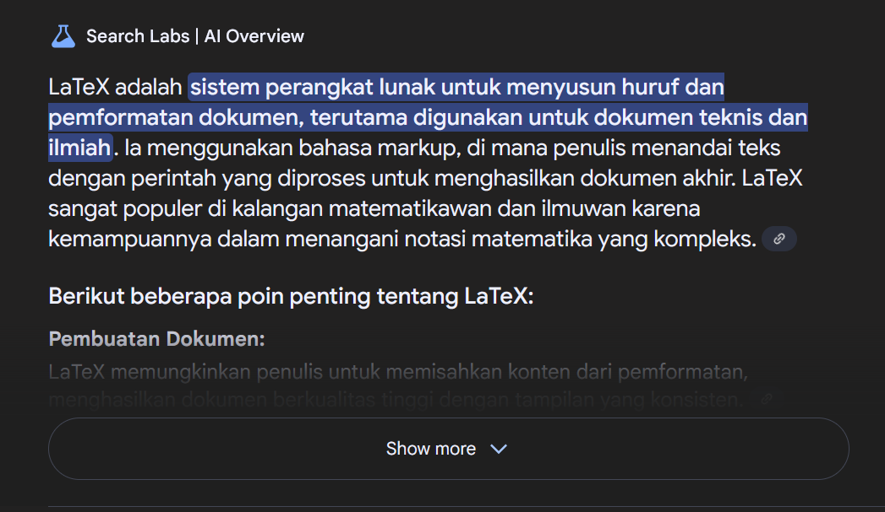
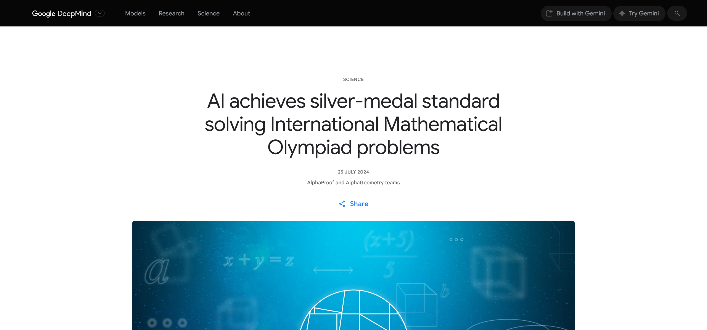

# Summer of Discrete Math Exposition
> Task Seleksi Lab IRK created by Naufal

versi **29/07/2025**

## 💡 Latar Belakang
Sebagai calon asisten Lab IRK, kalian diberikan tantangan seru yaitu membuat soal kuis Matematika Diskrit. Task ini dirancang untuk menguji sejauh mana kreativitas, logika, dan pemahaman kalian terhadap konsep-konsep Matematika Diskrit dengan membuat soal yang original dan belum pernah diujikan sebelumnya. Lebih dari sekadar latihan membuat soal, ini adalah kesempatan untuk menunjukkan bahwa kalian layak menjadi bagian dari asisten Lab IRK selanjutnya.

 
  <b>Fig 1.</b> Math is Everywhere
 

 

## Spesifikasi Wajib (1200 Poin)

### 1. Pembuatan Soal dan Jawaban

Buatkan 10 soal Matematika Diskrit yang mencakup seluruh materi pada mata kuliah IF1220 Matematika Diskrit dengan ketentuan sebagai berikut:
1) 3 soal pada materi **Logika, Himpunan, Relasi dan Fungsi**
2) 3 soal pada materi **Induksi Matematika - Deretan, Rekursi, dan Relasi Rekurens - Aljabar Boolean**
3) 2 soal pada materi **Teori Bilangan, Kombinatorika**
4) 2 soal pada materi **Graf, Pohon, Kompleksitas Algoritma**
5) Tiap sub-materi hanya dapat dijadikan satu soal
6) Jika jumlah materi lebih banyak dibandingkan jumlah soal yang harus dibuat, pilihlah materi yang kalian lebih pahami untuk dibuat
7) Diperbolehkan untuk menggabungkan beberapa sub-materi ke dalam satu soal
8) Setiap soal harus diberikan tingkat kesulitan **Easy/Medium/Hard** dan alasan yang jelas mengapa diberikan tingkat kesulitan tersebut
9) Setiap soal harus diberikan kunci jawabannya dengan penjelasan yang jelas di setiap langkahnya. Format jawaban dapat dilihat pada website Pak Rinaldi atau kunci jawaban berikut sebagai [contoh](https://informatika.stei.itb.ac.id/~rinaldi.munir/Matdis/2024-2025-2/Solusi-Kuis-1-IF1220-2025.pdf)
10) Berkas soal dan jawaban dibuat terpisah dan dikumpulkan dalam format `.pdf`

## Spesifikasi Bonus (600 Poin)

### 1. LaTex Sebagai Text Editor

 
  <b>Fig 2.</b> Apa itu LaTex?
 

 

Salah satu keuntungan utama LaTex adalah dapat menghasilkan berkas dalam format teks biasa (`.tex`), sehingga sangat cocok digunakan bersama git untuk version control. Untuk mendapatkan bonus ini, buatlah dokumen menggunakan LaTeX, lalu export ke format `.pdf`. Pastikan file mentah (`.tex`) juga disertakan dalam repository github kalian sebagai bukti penggunaan LaTeX.

### 2. Soal Anti-LLM

 
  <b>Fig 3.</b> Mending jadi petani kaya Thanos
 

 

Perkembangan LLM tidak dapat dipungkiri berkembang sangat cepat. Dimulai saat awal ChatGPT menjadi mainstream hingga sekarang, beberapa model LLM bahkan diklaim dapat mengerjakan soal IMO hingga setara dengan peraih medali perak. Buatlah soal yang tidak dapat dikerjakan oleh LLM mainstream seperti **ChatGPT, Claude, Gemini, dan DeepSeek**. Semakin banyak soal yang tidak dapat dikerjakan oleh LLM tersebut maka nilai untuk bonus ini semakin besar. Uji coba akan dilakukan oleh akun LLM penilai dan hanya menggunakan satu prompt untuk mendapatkan jawabannya. Jumlah prompt dapat ditambahkan jika terkena limit panjang prompt dengan membagi prompt soal menjadi beberapa bagian.

### 3. 3b1b Wannabe

Nama task terinspirasi dari **Summer of Math Exposition** yang dibuat oleh Grant Sanderson aka [3Blue1Brown](https://www.youtube.com/@3blue1brown). Dalam perkembangan channel youtubenya, Grant membuat sebuah library python untuk membuat video animasi matematika. Library tersebut awalnya hanya untuk pengembangan pribadi untuk channel youtubenya. Akan tetapi, popularitas dari video 3Blue1Brown menciptakan komunitas pengembang library tersebut sehingga lebih mudah untuk digunakan oleh banyak orang. Library tersebut sekarang telah berkembang menjadi [Manim](https://docs.manim.community/en/stable/). Untuk mendapatkan bonus ini, buatlah video animasi matematika menggunakan library tersebut untuk menjelaskan jawaban dari salah satu soal yang telah kalian buat. Video tersebut harus dilengkapi dengan voice over sehingga isi dari penjelasan dapat dimengerti secara jelas. Buatkan video animasi sekreatif mungkin. Tidak diperbolehkan untuk mengedit video yang dihasilkan untuk menambah konten dari video kecuali untuk menambahkan voice over. Video yang telah dibuat kemudian diunggah ke youtube lalu sertakan link-nya pada readme repository yang dikumpulkan. Kumpulkan juga source code pada repository tersebut. 

## 📂 Pengerjaan dan Pengumpulan
1. Buatlah repositori **private** pada github masing-masing dan invite `SandWithCheese` dalam repositori tersebut.
2. Berkas yang dikumpulkan berupa **link rilis tag ke repositori github** yang telah dibuat dengan ketentuan sebagai berikut.
    - Memberikan tag `vn` pada commit terakhir setiap kali ingin melakukan submisi dengan `n` adalah jumlah submisi yang telah dilakukan. (contoh: `v1` untuk submisi pertama).
    - **Tidak menggunakan *url shortener*** (bit.ly, shortlink, atau yang lain) saat melakukan pengumpulan *task*.
3. **Lakukan submisi** pada website seleksi IRK dengan menggunakan akun std.stei.itb.ac.id, **lakukan konfirmasi** ke LINE `@naufal022`. Lakukan hal yang sama jika membuat rilis yang baru.
4. Jika terdapat pertanyaan dapat menghubungi LINE `@naufal022`.

## 📌 Penilaian

| No. | Item                     | Poin Maximum |
| :-- | :----------------------- | :----------- |
|     | **Spesifikasi Wajib**    |              |
| 1   | Pembuatan Soal dan Jawaban        | 1200 (120x10)          |
|     | **Spesifikasi Bonus**    |              |
| 1   | LaTex Sebagai Text Editor   | 200          |
| 2   | Soal Anti-LLM   | 200 (20x10)          |
| 3   | 3b1b Wannabe         | 200          |
|     | **Total**                | **1800+**    |

**Basssss**
